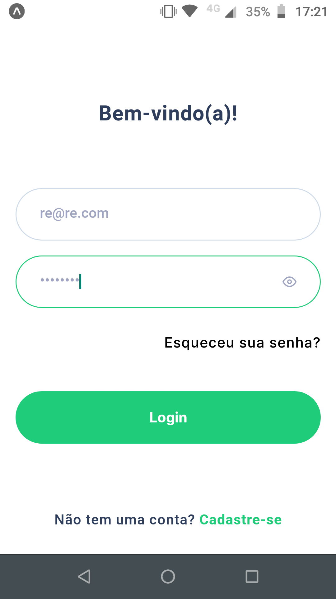
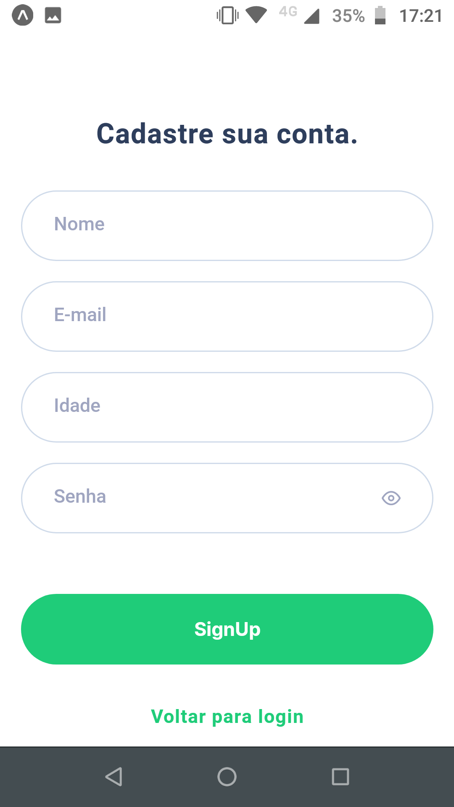
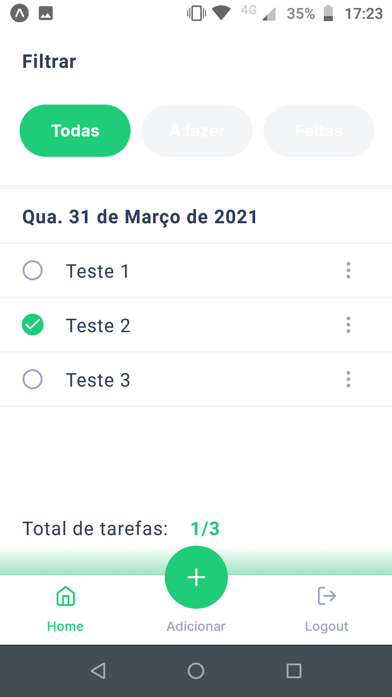
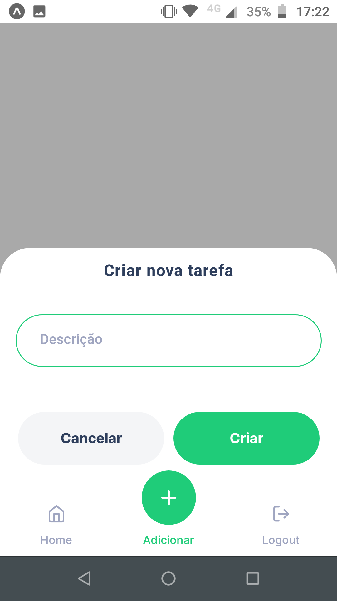
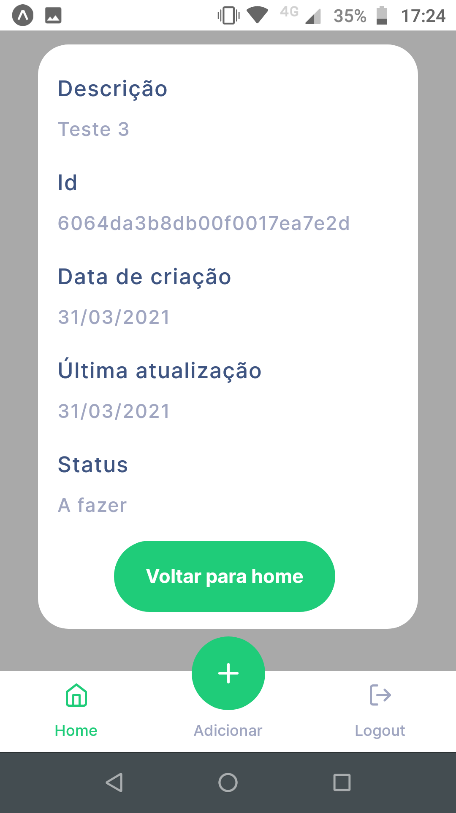

# Stalo_React-Native
Desafio realizado para o processo seletivo da Stalo, seguindo o layout e utilizando a api do [notion](https://www.notion.so/Desafio-Mobile-React-Native-1deef46488b745f19445647ab2ebf033).

## Sobre o Stalo_React-Native

Este é um aplicativo android/ios desenvolvido pelo expo, onde o mesmo é um app de ToDo.
Ele apresenta um sistema de autenticação onde não é possível se manter na página Home sem estar logado.
<p align="center">
  
  
</p>

Dentro do app, é possível criar, editar, deletar e filtrar tarefas, além de visualizar mais informações sobre.

<p align="center">
  
  
  
</p>

## Dependências

Inicialmente para baixar as dependências, você precisa rodar:

```
npm install
ou
yarn
```
Com as dependências instaladas, você pode rodar:

```
npm run start
ou
yarn start
```
Onde uma página web irá abrir te dando opções para carregar o projeto.
Foi utilizado para o projeto um <strong>device físico G4Plus</strong>. Portanto não se sabe o estado do mesmo na versão web devido ao fato de não ter compatibilidade com os alerts do react-native.

Caso queira logar em um usuário já existente, pode usar o fornecido pelo exemplo do Postman:
```
"name": "Muhammad Nur Ali",
"email": "muh.nurali43@gmail.com",
```
Ou se desejar criar um novo, sinta-se a vontade. Só um alento que o password mínimo é de no mínimo 7 caracteres.


